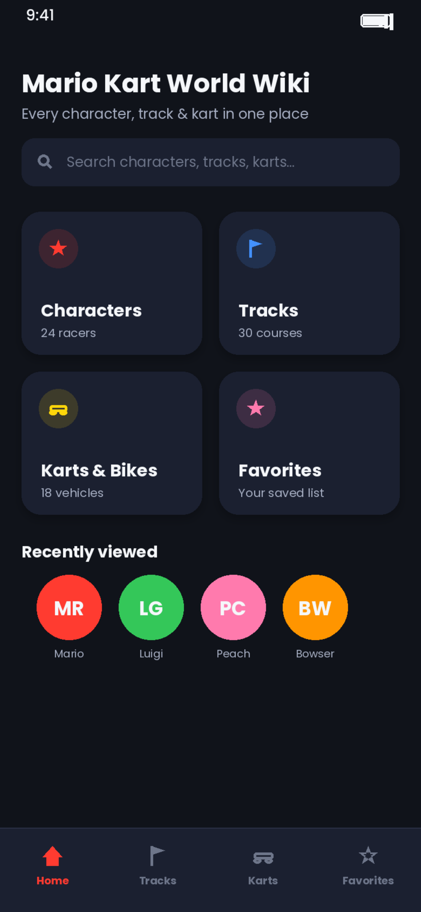
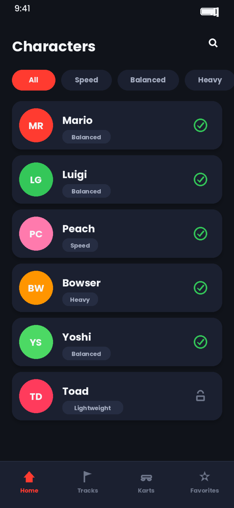
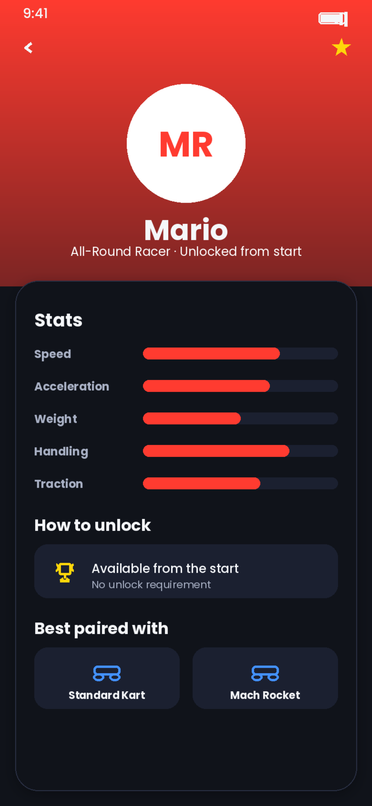
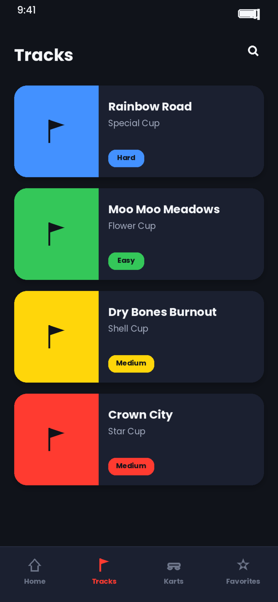
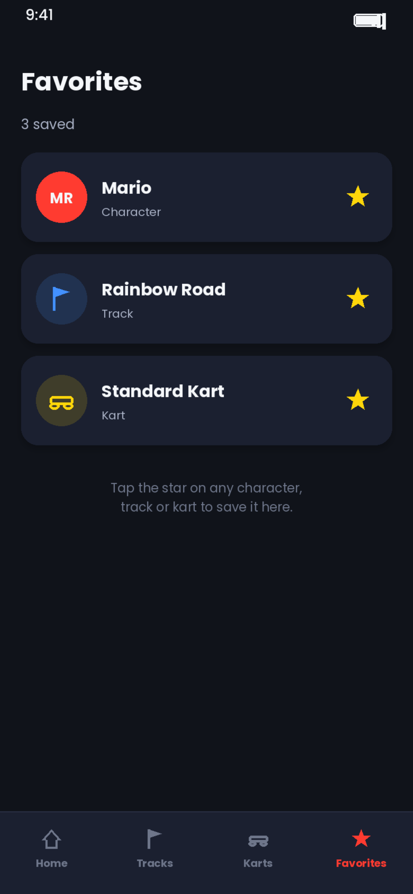

# Mockup and wireframes

The visual plan for this app. The wireframes answered what goes where; the
mockup shows what it looks like.

## Mockup

Full mockup: [mockup.pdf](assets/mockup.pdf)

Primary flow: **Home → Characters → Character Detail → Tracks → Favorites.**

### Home

Four category cards (Characters, Tracks, Karts & Bikes, Favorites), a search
bar, and a "Recently viewed" row of racer avatars.

### Character Guide

Filter chips (All / Speed / Balanced / Heavy) above a list of racers, each
row showing avatar, name, class, and an unlock status icon (green check or
lock).

### Character Detail — the app's signature screen

Hero header (avatar, name, favorite star), a Stats section (five bars:
Speed, Acceleration, Weight, Handling, Traction), a "How to unlock" card, and
"Best paired with" kart suggestions.

### Track Guide

Cup-colored cards, one per track, each with a difficulty badge (Easy /
Medium / Hard).

### Favorites

Everything starred — characters, tracks, or karts — in one list, tagged by
type. Empty state: "Tap the star on any character, track or kart to save it
here."

## Wireframes

_(Add your earlier box-and-label sketches and flow diagram here if you have
them — photos of paper are fine.)_

## Screens

See each screen's description above. Navigation: a persistent bottom bar
(Home / Tracks / Karts / Favorites) appears on every screen except the
Detail screens, which use a back chevron instead. Character Guide has no
dedicated tab of its own — it's reached from the Home category card, and
"Home" stays highlighted while it's open.
