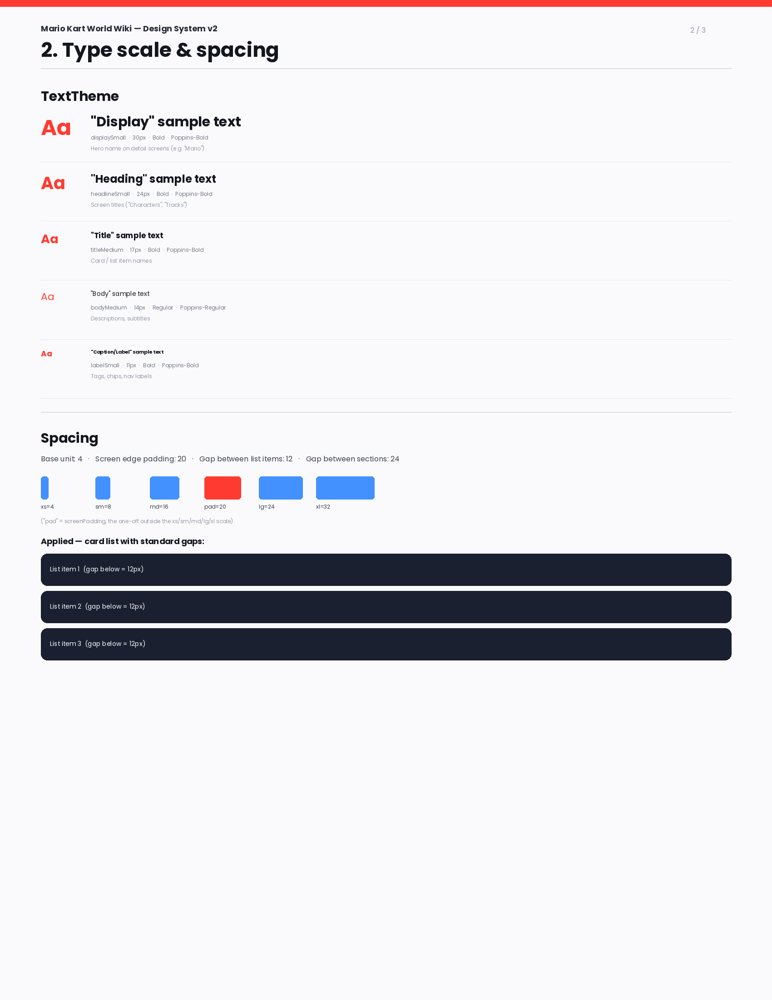
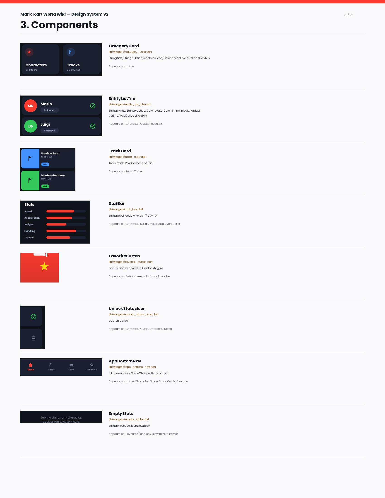

# Design system

Paste in the design system you submitted, and replace it with the final version
when the project is done. It is also the reference you open every time you build
a new screen, so keeping it current helps you more than it helps anyone reading.

**This document needs a visual, not just this text.** Export a PDF or an image
that *shows* your palette, type scale, spacing and components, put it in
`assets/`, and link it here:

```markdown

[Design system (PDF)](assets/design-system.pdf)
```

Figma, Canva, Excalidraw, Google Slides or Docs exported to PDF all work. A
reader should be able to see your app's look in one glance, without reading a
table.

## Palette

## Type scale

## Spacing

## Components


One row per reusable widget: what it is, which file it lives in, what parameters
it takes, which screens use it.

## Changes since the last version
