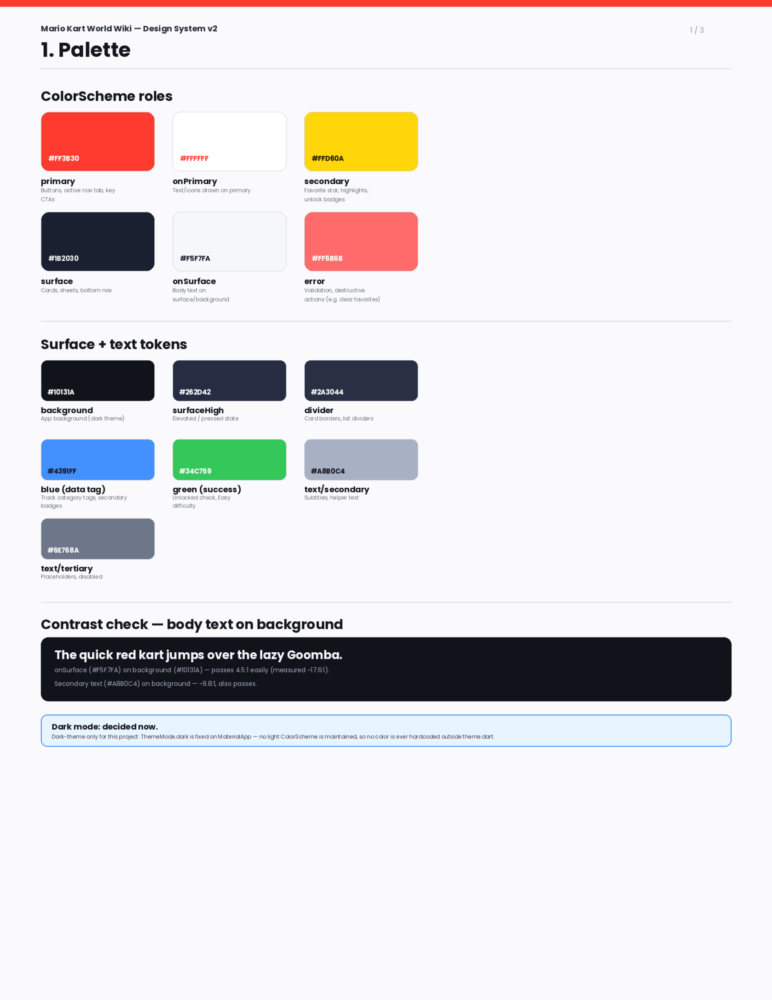

# Design system

Full design system: [design-system.pdf](assets/design-system.pdf)

Figma export, 3 pages: Palette; Type scale & spacing; Components. Dark theme
only — decided project-wide, no light `ColorScheme` is maintained.

## Palette

| Token | Hex | Used for |
| --- | --- | --- |
| primary | `#FF3B30` | Buttons, active nav tab, key CTAs |
| onPrimary | `#FFFFFF` | Text/icons drawn on primary |
| secondary | `#FFD60A` | Favorite star, highlights, unlock badges |
| surface | `#1B2030` | Cards, sheets, bottom nav |
| onSurface | `#F5F7FA` | Body text on surface/background |
| error | `#FF6B6B` | Validation, destructive actions |
| background | `#10131A` | App background (dark theme) |
| surfaceHigh | `#262D42` | Elevated / pressed state |
| divider | `#2A3044` | Card borders, list dividers |
| blue (data tag) | `#4391FF` | Track category tags, secondary badges |
| green (success) | `#34C759` | Unlocked check, Easy difficulty |
| text/secondary | `#A8B0C4` | Subtitles, helper text |
| text/tertiary | `#6E768A` | Placeholders, disabled |

Implemented as `AppColors` in `lib/theme/theme.dart` — every color in the app
comes from there; nothing is hardcoded elsewhere.

## Type scale

All Poppins (via the `google_fonts` package).

| Style | Size | Weight | Used for |
| --- | --- | --- | --- |
| Display | 30px | Bold | Hero name on detail screens (e.g. "Mario") |
| Heading | 24px | Bold | Screen titles ("Characters", "Tracks") |
| Title | 17px | Bold | Card / list item names |
| Body | 14px | Regular | Descriptions, subtitles |
| Caption/Label | 11px | Bold | Tags, chips, nav labels |

## Spacing

Base unit 4 · screen edge padding 20 · gap between list items 12 · gap
between sections 24.

`xs=4 · sm=8 · md=16 · pad=20 · lg=24 · xl=32` — implemented as `AppSpacing`
in `lib/theme/theme.dart`.

## Components

| Component | File | Props | Appears on |
| --- | --- | --- | --- |
| CategoryCard | `lib/widgets/category_card.dart` | title, subtitle, icon, accent, onTap | Home |
| EntityListTile | `lib/widgets/entity_list_tile.dart` | name, subtitle, avatarColor, initials, imageAsset, trailing, onTap | Character Guide, Favorites |
| CharacterAvatar | `lib/widgets/character_avatar.dart` | imageAsset, initials, color, radius | EntityListTile, Home, Character Detail |
| TrackCard | `lib/widgets/track_card.dart` | track, onTap | Track Guide |
| StatBar | `lib/widgets/stat_bar.dart` | label, value (0.0–1.0) | Character Detail, Track Detail, Kart Detail |
| FavoriteButton | `lib/widgets/favorite_button.dart` | isFavorited, onToggle | Detail screens, Favorites |
| UnlockStatusIcon | `lib/widgets/unlock_status_icon.dart` | unlocked | Character Guide, Character Detail |
| AppBottomNav | `lib/widgets/app_bottom_nav.dart` | currentIndex, onTap | Home, Character Guide, Track Guide, Favorites |
| EmptyState | `lib/widgets/empty_state.dart` | message, icon | Favorites (and any empty list) |

## Changes since the last version

- Added `imageAsset` to `EntityListTile`/`CharacterAvatar` so a character row
  can show a real face image instead of initials, falling back to initials
  automatically when no image is set.
